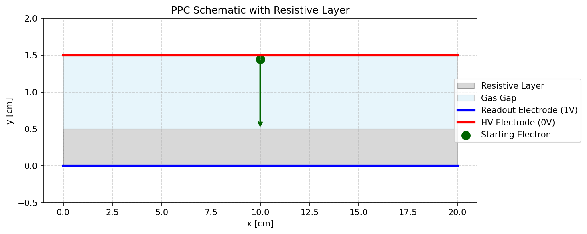
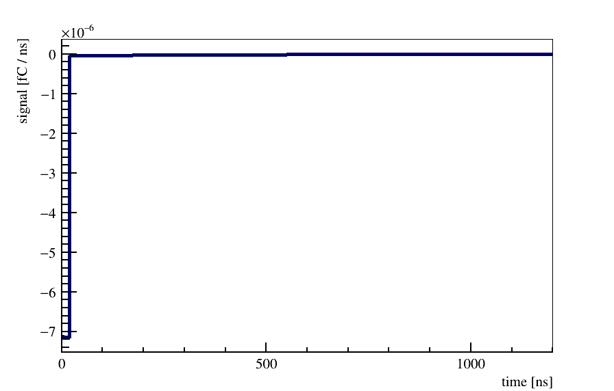
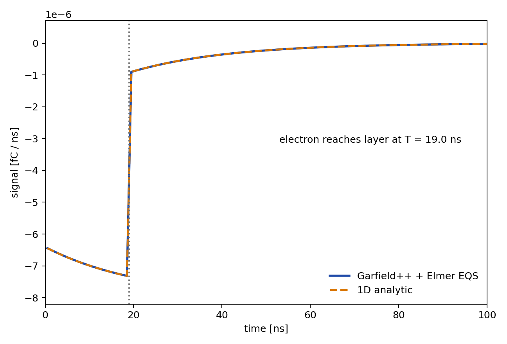
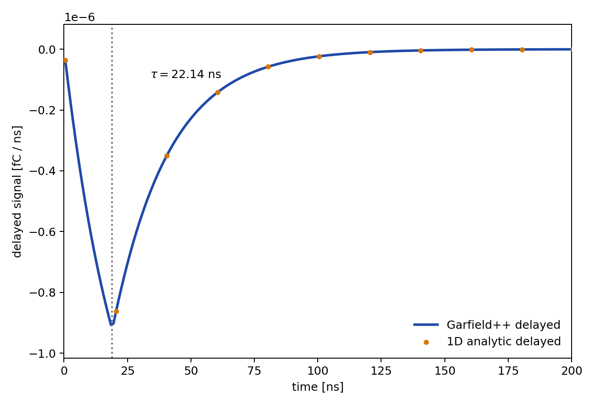

# 2D Parallel Plate: Dynamic Weighting Potential

This activity extends the static parallel-plate exercise by giving the
resistive layer a finite conductivity. You will solve a time-dependent
weighting potential in Elmer, load it in Garfield++, and compare the simulated
signal with the analytic 1D result.

Start with the static activity first. This activity assumes you already know
what the Gmsh physical groups and static weighting potential represent.



## What Changes From the Static Case

In the static activity, the resistive layer is treated as a dielectric. The
prompt signal integrates to about `0.844 e` for the default electron track.

Here the layer also has a conductivity. At very early times the response looks
like the dielectric weighting field. At long times, charge in the resistive
layer relaxes, and the gas/resistive interface behaves more like it is tied to
the readout electrode. The missing charge appears as a delayed tail.

## Files

- `geometry/ppc_geometry.geo`: same geometry as the static activity
- `elmer/drift_field.sif`: electrostatic drift-field solve
- `elmer/weighting_static.sif`: prompt weighting-potential solve
- `elmer/weighting_dynamic_eqs.sif`: transient EQS weighting-potential solve
- `elmer/weighting_dynamic.sif`: older heat-equation approximation for comparison only
- `elmer/materials.dat`: material map used by Garfield++
- `garfield/sim_transient.cpp`: Garfield++ driver
- `scripts/compare_analytic_signal.py`: analytic 1D comparison and plotting script

## Summary of Theory

The drift field and prompt weighting potential are electrostatic:

$$
\nabla \cdot \left(\varepsilon \nabla V\right) = 0,
\qquad
\nabla \cdot \left(\varepsilon \nabla \phi_w^{(0)}\right) = 0.
$$

The dynamic weighting-potential formalism used here follows Riegler's
quasistatic extension of the weighting-field theorem for detectors containing
conductive materials. In the electroquasistatic limit, the total current density
in the weighting-field problem is

$$
\mathbf{J}_w =
\sigma \mathbf{E}_w
+ \frac{\partial}{\partial t}\left(\varepsilon \mathbf{E}_w\right),
\qquad
\mathbf{E}_w = -\nabla \phi_w.
$$

With no volume source in the weighting-field solve, current continuity gives
$\nabla \cdot \mathbf{J}_w = 0$. This gives the conductive-dielectric equation
we solve in Elmer:

$$
\nabla \cdot \left[
  \sigma \nabla \phi_w(\mathbf{r}, t)
  + \varepsilon \nabla
    \frac{\partial \phi_w(\mathbf{r}, t)}{\partial t}
\right] = 0.
$$

The moving electron is not part of this Elmer solve. The weighting field is a
detector response function. Once it is known, Garfield++ can use it for any
drifting charge trajectory.

The initial condition matters. Garfield++ stores the dynamic map as a delayed
correction relative to the prompt weighting potential:

$$
\Delta \phi_w(\mathbf{r}, t)
= \phi_w(\mathbf{r}, t) - \phi_w^{(0)}(\mathbf{r}).
$$

For that reason, the transient Elmer solve must start from the static prompt
weighting solution. Starting from zero would artificially cancel the prompt
signal and produce a delayed pulse with the wrong time structure.

In `weighting_dynamic_eqs.sif`, this is the important line:

```text
Restart File = File "../output/elmer/weighting_static.result"
```

The solver line is:

```text
Procedure = "QuasiElectrostaticSolver" "QuasiElectrostaticSolver"
```

For this activity, assume this solver is already installed with Elmer.

## 1. Rebuild the Mesh

```bash
cd plate2D/dynamic
source setup_env.sh
mkdir -p output output/elmer output/garfield
gmsh geometry/ppc_geometry.geo -2 -order 2 -format msh2 -o output/ppc_geometry.msh
ElmerGrid 14 2 output/ppc_geometry.msh -autoclean -out output/mesh
```

This is the same geometry as the static exercise: a `0.5 cm` resistive layer
and a `1.0 cm` gas gap.

## 2. Run the Elmer Solves

```bash
cd elmer
ElmerSolver drift_field.sif
ElmerSolver weighting_static.sif
ElmerSolver weighting_dynamic_eqs.sif
cd ..
```

Check these entries in `weighting_dynamic_eqs.sif`:

- `Electric Conductivity = 1.0e-4` in the resistive layer,
- `Relative Permittivity = 4.0` in the resistive layer,
- `TimeStep Sizes = 1.0e-9`,
- `TimeStep Intervals = 1200`.

The output file `output/elmer/weighting_dynamic_eqs.result` contains one
transient weighting-potential map per time step.

## 3. Run Garfield++

```bash
cmake --fresh -S garfield -B garfield/build
cmake --build garfield/build
./garfield/build/sim_transient
```

If CMake still points at an old ROOT installation, remove `garfield/build` once
and rerun the configure step.

The key Garfield++ calls are:

```cpp
elm.SetWeightingPotential(promptWeighting.string(), "Readout");
elm.SetDynamicWeightingPotential(transientWeighting.string(), "Readout");

sensor.AddElectrode(&elm, "Readout");
sensor.EnableDelayedSignal(true);
sensor.SetTimeWindow(0., 1.0, 1200);
```

The program writes `output/garfield/signal_transient.dat`, with columns for the
total, prompt, and delayed signal.

Example full-scale signal:



On this scale the delayed tail is hard to see because the prompt current is
much larger. The analytic comparison script below makes a tail zoom.

## 4. Analytic 1D Result

For the wide central region of this geometry, the 2D finite-element solution
should agree with the 1D parallel-plate result. In this section you will reduce
the dynamic weighting-field problem to one interface potential. This is the
same conductive-layer parallel-plate setup treated in the Riegler proceedings
paper, specialized to the geometry used in this activity.

Use:

$$
d_1 = 0.5~\mathrm{cm},
\qquad
d_2 = 1.0~\mathrm{cm},
\qquad
\varepsilon_r = 4,
\qquad
\sigma = 10^{-4}~\mathrm{S/m}.
$$

Let $u(t)$ be the weighting potential at the gas/resistive interface. The
bottom readout electrode is fixed at $\phi_w = 1$, and the top electrode is
fixed at $\phi_w = 0$.

Because this is a 1D parallel-plate problem, the fields are uniform in each
layer. Write the gas and resistive-layer fields in terms of $u(t)$:

$$
E_g(t) = \frac{u(t)}{d_2},
\qquad
E_r(t) = \frac{1 - u(t)}{d_1}.
$$

Now use current continuity at the interface. The gas has essentially no
conductivity, so its current is displacement current. The resistive layer has
both conductive and displacement current:

$$
J_g = \varepsilon_0 \frac{dE_g}{dt},
\qquad
J_r = \sigma E_r + \varepsilon_r \varepsilon_0 \frac{dE_r}{dt}.
$$

Set $J_g = J_r$ and use the two field expressions above. After simplifying,
you should get a first-order relaxation equation for $u(t)$:

$$
\frac{du}{dt}
=
\frac{\sigma d_2}{\varepsilon_0(d_1 + \varepsilon_r d_2)}
\left(1 - u\right).
$$

This means the 1D relaxation time is

$$
\tau =
\frac{\varepsilon_0(d_1 + \varepsilon_r d_2)}
     {\sigma d_2}.
$$

For the default values,

$$
\tau = 398~\mathrm{ns}.
$$

The initial value $u(0)$ is not zero. It is the prompt electrostatic weighting
solution from the static activity:

$$
u(0) =
\frac{\varepsilon_r d_2}{d_1 + \varepsilon_r d_2}.
$$

The long-time value is $u(\infty) = 1$. Solve the ODE with this initial
condition:

$$
u(t) =
1 -
\left[
  1 -
  \frac{\varepsilon_r d_2}{d_1 + \varepsilon_r d_2}
\right] e^{-t/\tau}.
$$

Divide by $d_2$ to get the weighting field in the gas:

$$
E_g(t) =
E_w^{(0)} + \Delta E_w \left(1 - e^{-t/\tau}\right).
$$

The prompt part is

$$
E_w^{(0)}
= \frac{\varepsilon_r}{d_1 + \varepsilon_r d_2}
= 0.889~\mathrm{cm^{-1}}.
$$

The delayed amplitude is

$$
\Delta E_w
= \frac{d_1}{d_2(d_1 + \varepsilon_r d_2)}
= 0.111~\mathrm{cm^{-1}}.
$$

The electron starts at $y = 1.45~\mathrm{cm}$ and stops at the gas/resistive
interface at $y = 0.5~\mathrm{cm}$, so

$$
T = \frac{1.45 - 0.5}{0.05} = 19~\mathrm{ns}.
$$

While the electron is drifting,

$$
i(t) =
-e v
\left[
  E_w^{(0)} + \Delta E_w \left(1 - e^{-t/\tau}\right)
\right],
\qquad 0 < t < T.
$$

After the electron reaches the resistive layer,

$$
i(t) =
-e v \Delta E_w
\left(1 - e^{-T/\tau}\right)
e^{-(t - T)/\tau},
\qquad t > T.
$$

This predicts an immediate prompt current, a small delayed correction during
the drift, and a long exponential tail after collection.

## 5. Compare Elmer/Garfield++ With the Analytic Result

Run:

```bash
python3 scripts/compare_analytic_signal.py
```

The script reads the conductivity from `weighting_dynamic_eqs.sif`, writes
`output/garfield/signal_transient_analytic.dat`, and makes two plots:

- `figures/signal_transient_analytic_overlay.png`
- `figures/signal_transient_tail_zoom.png`

Total-signal comparison over the first `100 ns`:



The first plot intentionally shows only the Garfield++/Elmer total signal and
the 1D analytic total signal. Use the delayed-tail zoom to see the much smaller
delayed component:



For the default setup, the script should report a very small residual between
the FEM/Garfield result and the analytic result. It should also print signal
integrals close to:

```text
prompt:  -0.844 e
delayed: -0.100 e  within the 0-1200 ns window
total:   -0.945 e  within the 0-1200 ns window
```

The infinite-time total is `-0.950 e`. It is not exactly `-1 e` because the
electron starts at `y = 1.45 cm`, slightly below the top electrode at
`y = 1.5 cm`. The remaining difference between `-0.945 e` and `-0.950 e` is in
the tail beyond the plotted time window.

## Questions to Answer

- Why does the signal start immediately in the corrected dynamic calculation?
- Why did starting the transient map from zero produce a delayed pulse with little prompt signal?
- Why is the static prompt integral only about `0.844 e`?
- Why does the dynamic signal approach about `0.950 e` when integrated long enough?
- Where does the electron stop, and why does the prompt signal stop there?

## Things to Try

- Change the resistive-layer conductivity by a factor of `10`. Remember that higher resistivity means smaller conductivity.
- After changing conductivity, rerun `weighting_dynamic_eqs.sif`, `sim_transient`, and `compare_analytic_signal.py`.
- Predict how $\tau$ changes before looking at the plot.
- Compare the prompt and delayed integrals. Does the total charge change, or is the charge mostly redistributed in time?
- Try a shorter signal window, for example `200 ns`. How much delayed charge is missed?
- Start the electron closer to the top electrode. How does the total integrated charge change?

## Main Takeaway

The static weighting field gives the immediate prompt response. The dynamic
weighting field does not create a new drifting charge; it describes how the
detector materials relax after the charge moves. In this simple geometry, the
finite-element result can be checked almost exactly against the 1D analytic
solution, which is why this is a useful test of the Elmer solver and the
Garfield++ dynamic weighting-field import.

## References

- W. Riegler, "Extended theorems for signal induction in particle detectors,"
  Nuclear Instruments and Methods in Physics Research A 535 (2004) 287-293.
  The quasistatic conductive-material formalism and the parallel-plate
  conductive-layer example used here are discussed in this paper.
  DOI: [10.1016/j.nima.2004.07.129](https://doi.org/10.1016/j.nima.2004.07.129).
- W. Riegler and P. Windischhofer, "Signals induced on electrodes by moving
  charges, a general theorem for Maxwell's equations based on
  Lorentz-reciprocity," Nuclear Instruments and Methods in Physics Research A
  980 (2020) 164471. This paper gives the broader full-Maxwell reciprocity
  context and places the quasistatic weighting-field approaches in perspective.
  DOI: [10.1016/j.nima.2020.164471](https://doi.org/10.1016/j.nima.2020.164471).
