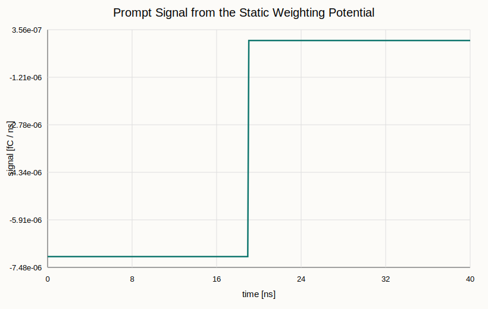

# 2D Parallel Plate: Static Weighting Potential

In this activity you will build a simple 2D detector geometry, solve two
electrostatic field maps in Elmer, and use Garfield++ to calculate the prompt
signal from one drifting electron.

The goal is not only to run the example. You should leave with a working mental
model for how Gmsh geometry, Elmer physical groups, and Garfield++ field-map
loading fit together.


## What You Will Build

The detector is a wide parallel-plate stack:

- a resistive layer from $y = 0$ to $y = d_1$,
- a gas gap from $y = d_1$ to $y = d_1 + d_2$,
- a readout electrode at the bottom,
- a high-voltage electrode at the top.

The default values are

$$
d_1 = 0.5~\mathrm{cm},
\qquad
d_2 = 1.0~\mathrm{cm},
\qquad
\varepsilon_r = 4.
$$

## Files

- `geometry/ppc_geometry_template.geo`: starter geometry with blanks
- `geometry/ppc_geometry.geo`: complete working geometry
- `geometry/ppc_geometry_solution.geo`: backup solution
- `elmer/electric_field.sif`: electrostatic drift-field solve
- `elmer/weighting_field.sif`: static weighting-potential solve
- `garfield/sim_static.cpp`: Garfield++ driver
- `scripts/check_static_signal.py`: quick analytic cross-check

## 1. Complete the Gmsh Geometry

Start from `geometry/ppc_geometry_template.geo`. If you get stuck, compare with
`geometry/ppc_geometry_solution.geo`; if time is short, use
`geometry/ppc_geometry.geo` directly.

Gmsh `.geo` files are just a sequence of geometry definitions. The first block
sets dimensions and the mesh size:

```c
lc = 0.1;
width = 20.0;
gap = 1.0;
layer = 0.5;
```

The fourth number in each point is the target mesh size near that point:

```c
Point(1) = {0, 0, 0, lc};
Point(2) = {width, 0, 0, lc};
Point(3) = {width, layer, 0, lc};
Point(4) = {0, layer, 0, lc};
Point(5) = {width, layer + gap, 0, lc};
Point(6) = {0, layer + gap, 0, lc};
```

Connect the points with lines. The line from point 3 to point 4 is the shared
interface between the gas and the resistive layer:

```c
Line(1) = {1, 2};  // Bottom electrode
Line(2) = {2, 3};
Line(3) = {3, 4};  // Shared interface
Line(4) = {4, 1};
Line(5) = {3, 5};
Line(6) = {5, 6};  // Top electrode
Line(7) = {6, 4};
```

A `Curve Loop` is an oriented closed path. A `Plane Surface` fills that loop.
The gas surface uses `-3` because it traverses the shared interface in the
opposite direction:

```c
Curve Loop(1) = {1, 2, 3, 4};
Plane Surface(1) = {1};

Curve Loop(2) = {5, 6, 7, -3};
Plane Surface(2) = {2};

Recombine Surface {1, 2};
```

Physical groups are the names Elmer will see. Without them, you would have a
mesh but no easy way to assign materials or boundary voltages:

```c
Physical Surface("ResistiveLayer", 1) = {1};
Physical Surface("GasGap", 2) = {2};

Physical Curve("BottomElectrode", 11) = {1};
Physical Curve("TopElectrode", 12) = {6};
```

Checkpoint: the gas and resistive layer must share the same interface line. Do
not create two separate overlapping interface lines.

## 2. Mesh and Convert for Elmer

From the activity directory:

```bash
cd plate2D/static
source setup_env.sh
mkdir -p output output/elmer output/garfield
gmsh geometry/ppc_geometry.geo -2 -order 2 -format msh2 -o output/ppc_geometry.msh
ElmerGrid 14 2 output/ppc_geometry.msh -autoclean -out output/mesh
cat output/mesh/mesh.names
```

You should see names for `ResistiveLayer`, `GasGap`, `BottomElectrode`, and
`TopElectrode`.

## 3. Solve the Static Field Maps

Run the physical drift field first:

```bash
cd elmer
ElmerSolver electric_field.sif
```

Then run the static weighting-potential solve:

```bash
ElmerSolver weighting_field.sif
cd ..
```

Open the `.sif` files and find the two important differences:

- in `electric_field.sif`, the bottom electrode is at `1000 V` and the top is at `0 V`,
- in `weighting_field.sif`, the readout electrode is set to `1` and the opposite electrode is set to `0`.

## 4. Analytic Weighting Field

Before running Garfield++, compute the 1D answer. The static weighting
potential satisfies

$$
\nabla \cdot \left(\varepsilon \nabla \phi_w\right) = 0.
$$

For this layered parallel-plate geometry, the displacement field is constant
through the stack. In the gas, the prompt weighting field is

$$
E_w^{(0)} =
\frac{\varepsilon_r}{d_1 + \varepsilon_r d_2}.
$$

With the default geometry,

$$
E_w^{(0)} =
\frac{4}{0.5 + 4 \cdot 1.0}
= 0.889~\mathrm{cm^{-1}}.
$$

The weighting potential at the gas/resistive interface is

$$
\phi_w(d_1) =
\frac{\varepsilon_r d_2}{d_1 + \varepsilon_r d_2}
= 0.889.
$$

The example electron starts at $y = 1.45~\mathrm{cm}$ and stops at the
gas/resistive interface at $y = 0.5~\mathrm{cm}$. With the fixed drift speed
$v = 0.05~\mathrm{cm/ns}$, the collection time is

$$
T = \frac{1.45 - 0.5}{0.05} = 19~\mathrm{ns}.
$$

The expected integrated prompt signal is

$$
\frac{Q_\mathrm{prompt}}{e}
= -\Delta \phi_w
= -E_w^{(0)}(1.45 - 0.5)
= -0.844.
$$

The magnitude is less than one electron because this static calculation treats
the resistive layer as a pure dielectric. In the dynamic activity, the finite
conductivity of the layer lets the field relax at long times.

## 5. Run Garfield++

Build and run the example:

```bash
cmake --fresh -S garfield -B garfield/build
cmake --build garfield/build
./garfield/build/sim_static
```

If CMake still points at an old ROOT installation, remove `garfield/build` once
and rerun the configure step.

The important Garfield++ steps are:

```cpp
ComponentElmer2d elm;
elm.Initialise(...);
elm.SetMedium(1, &gas);
elm.SetWeightingPotential(weightingField.string(), "Readout");

Sensor sensor;
sensor.AddComponent(&elm);
sensor.AddElectrode(&elm, "Readout");
```

The program writes `output/garfield/signal_static.dat`.

## 6. Check the Signal

Make a simple SVG plot:

```bash
python3 scripts/plot_signal_svg.py \
  output/garfield/signal_static.dat \
  docs/figures/signal_static.svg
```

Example output:



Now compare the integral with the 1D estimate:

```bash
python3 scripts/check_static_signal.py
```

You should get an integrated signal close to `-0.844 e`. The sign is a
convention; the magnitude is the useful check.

## Questions to Answer

- Which Gmsh physical group becomes the gas material in Elmer?
- Why does the gas/resistive interface use `Line(3)` in one surface and `-3` in the other?
- Why is the static prompt integral about `0.844 e` rather than `1 e`?
- What would change if the electron started closer to the top electrode?
- What would change if you doubled the gas gap but kept the same drift speed?

## Things to Try

- Change `gap` in the Gmsh file, rerun the mesh and solves, and predict the collection time before running Garfield++.
- Change `Relative Permittivity` of the resistive layer in `weighting_field.sif` and recompute $E_w^{(0)}$.
- Compare this prompt-only signal with the prompt column in the dynamic activity.
